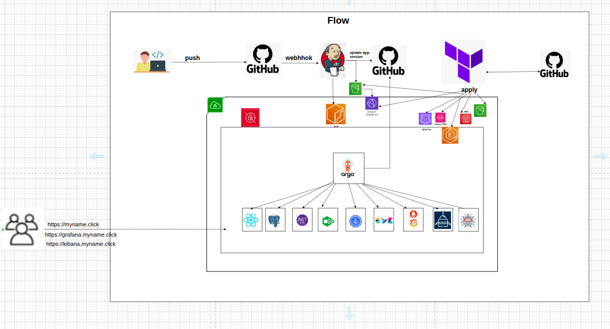
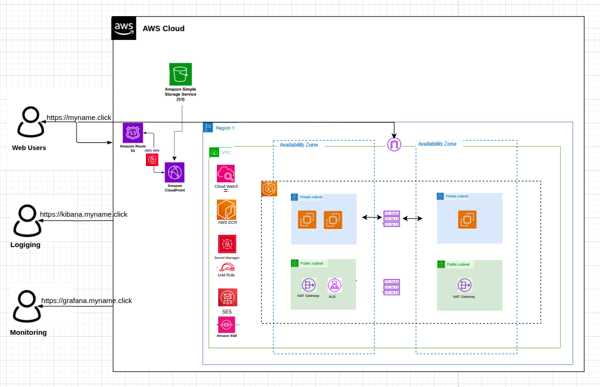
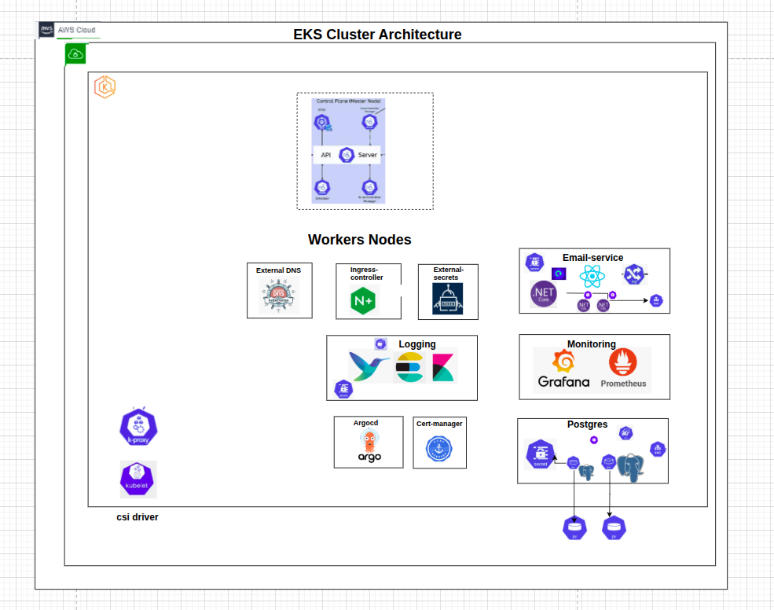
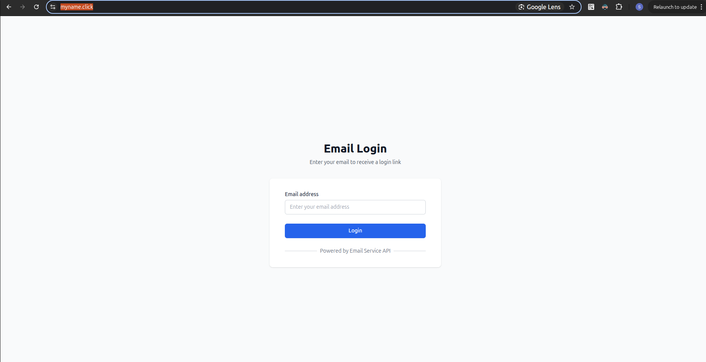
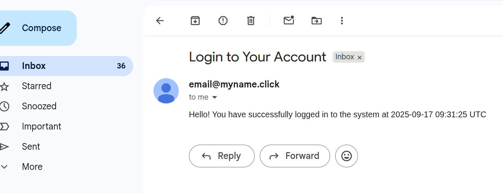
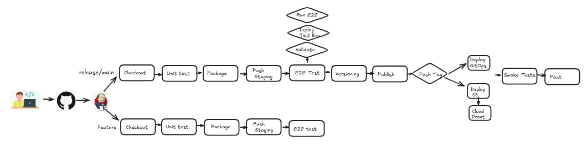
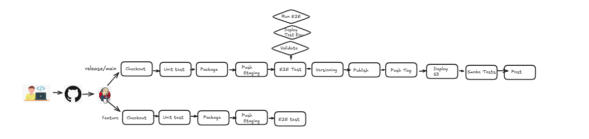
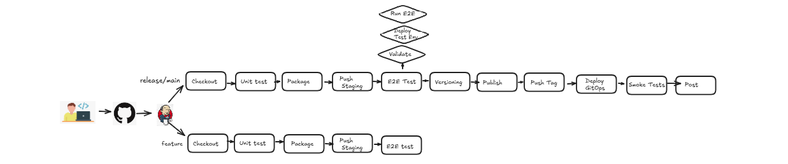
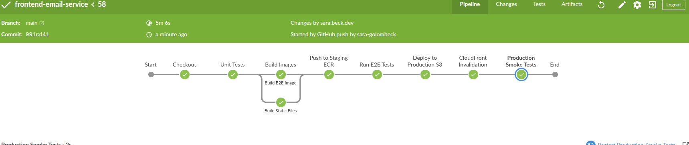
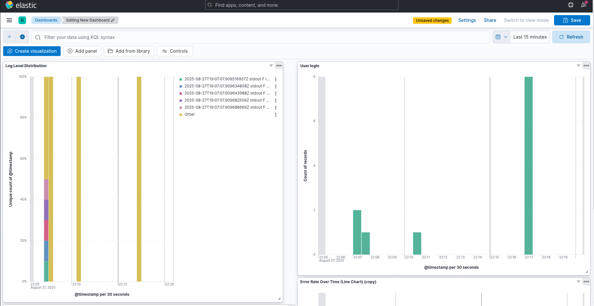

# Email Service Platform

A production-ready, cloud-native email service platform built on AWS EKS with GitOps deployment patterns. This platform provides a scalable, secure, and observable email processing system using microservices architecture.

**Automated Pipeline Trigger**: The moment a developer pushes code to the repository, the entire CI/CD pipeline automatically initiates, triggering a cascade of automated processes including testing, building, security scanning, and deployment.

## 🏗️ Architecture Overview



The platform demonstrates enterprise-grade DevOps practices with a complete microservices architecture:

### Application Microservices
- **Frontend**: React-based web application for email submission
- **Backend API**: .NET 8 REST API for email processing and queuing
- **Email Worker**: Background service for email delivery via AWS SES

### DevOps Infrastructure
- **Infrastructure as Code**: Terraform for AWS resource provisioning
- **GitOps Deployment**: ArgoCD for automated Kubernetes deployments
- **CI/CD Pipelines**: Jenkins for automated testing, building, and deployment
- **Monitoring Stack**: Prometheus, Grafana, and centralized logging
- **Security Automation**: Automated certificate management and secrets handling

### AWS Infrastructure



Our cloud-native infrastructure leverages:
- **AWS EKS**: Kubernetes cluster for container orchestration
- **AWS SQS**: Message queuing for reliable email processing
- **AWS SES**: Email delivery service
- **AWS S3 + CloudFront**: Static website hosting with CDN
- **PostgreSQL**: Database for user management and audit trails
- **AWS Route53**: DNS management for MYNAME.CLICK domain
- **AWS Secrets Manager**: Secure credential storage



### Application Flow



The application provides a seamless user experience:



## 🔄 CI/CD Pipeline



**Automated Pipeline Trigger**: The moment a developer pushes code to the repository, the entire CI/CD pipeline automatically initiates, triggering a cascade of automated processes including testing, building, security scanning, and deployment.

### Backend & Worker Pipeline


### Frontend Pipeline


### Pipeline Overview


The platform implements:
- **Automated Testing**: Unit tests, integration tests, and E2E tests
- **Production Environment**: Single production environment
- **GitOps Deployment**: ArgoCD for automated deployments
- **Security Scanning**: Container and dependency vulnerability scanning
- **Monitoring**: Prometheus metrics and Grafana dashboards

### Automated Workflow
1. **Code Push**: Developer pushes code changes
2. **CI Trigger**: Jenkins pipeline automatically starts
3. **Testing Phase**: Automated test execution
4. **Build Phase**: Docker image creation and scanning
5. **GitOps Sync**: ArgoCD detects changes and deploys
6. **Monitoring**: Automatic health checks and metrics collection

## 🚀 Quick Start

### Prerequisites

- AWS CLI configured with appropriate permissions
- Terraform >= 1.0
- kubectl
- Docker
- Helm 3.x

### Infrastructure Deployment

1. **Deploy AWS Infrastructure**:
   ```bash
   cd infra
   terraform init
   terraform plan
   terraform apply
   ```

2. **Configure kubectl**:
   ```bash
   aws eks update-kubeconfig --region <region> --name <cluster-name>
   ```

3. **Deploy Applications via GitOps**:
   ```bash
   cd gitops
   kubectl apply -f argocd/
   ```

### Local Development

1. **Backend Development**:
   ```bash
   cd application/backend
   docker-compose up -d  # Start PostgreSQL
   dotnet run --project src/EmailServiceAPI
   ```

2. **Frontend Development**:
   ```bash
   cd application/frontend
   npm install
   npm start
   ```

3. **Worker Development**:
   ```bash
   cd application/email-worker
   dotnet run --project src/EmailWorker
   ```

## 📁 Project Structure

```
email-service/
├── application/           # Application source code
│   ├── backend/          # .NET 8 Web API
│   ├── frontend/         # React application
│   ├── email-worker/     # Background email processor
│   └── e2e-email-service/ # End-to-end tests (external repository)
├── infra/                # Terraform infrastructure code
│   └── modules/          # Reusable Terraform modules
├── gitops/               # GitOps configuration
│   ├── argocd/          # ArgoCD applications
│   └── email-service/   # Helm charts
├── diagrams/             # Architecture diagrams
└── scripts/             # Utility scripts
```

## 🛡️ Security Features

- **IRSA (IAM Roles for Service Accounts)**: Fine-grained AWS permissions
- **Network Policies**: Kubernetes network segmentation  
- **Secrets Management**: AWS Secrets Manager with External Secrets Operator
- **TLS Encryption**: Automated Let's Encrypt certificates via cert-manager
- **Container Security**: Distroless images and vulnerability scanning
- **WAF Protection**: AWS WAF for frontend protection
- **DNS Security**: External DNS with secure domain management


## 📊 Monitoring & Observability



- **Metrics**: Prometheus for metrics collection and storage
- **Visualization**: Grafana dashboards with custom panels
- **Logging**: Centralized logging with Fluent Bit and Elasticsearch
- **Service Discovery**: Automatic service monitoring via ServiceMonitor CRDs
- **Alerting**: AlertManager for automated notifications
- **Health Checks**: Kubernetes liveness and readiness probes

## 🔧 Configuration

### Environment Variables

| Variable | Description | Default |
|----------|-------------|---------|
| `AWS_REGION` | AWS region | `us-east-1` |
| `CLUSTER_NAME` | EKS cluster name | `email-service-cluster` |
| `DOMAIN_NAME` | Primary domain | - |
| `DATABASE_URL` | PostgreSQL connection string | - |
| `SQS_QUEUE_URL` | SQS queue URL | - |

### Terraform Variables

Key variables in `infra/terraform.tfvars`:
- `cluster_name`: EKS cluster name
- `vpc_cidr`: VPC CIDR block  
- `domain_name`: Domain for SES configuration
- `addit_domain_name`: Primary domain (MYNAME.CLICK)
- `admin_user_arn`: Admin user ARN for EKS access
- `project_name`: Project identifier for resource naming
- `namespace`: Kubernetes namespace for applications

## 🧪 Testing

### Running Tests

```bash
# Backend tests
cd application/backend
dotnet test

# Frontend tests
cd application/frontend
npm test

# Worker tests
cd application/email-worker
dotnet test

# E2E tests
cd application/e2e-email-service
python -m pytest
```

### Test Coverage

- Unit tests for all business logic
- Integration tests for API endpoints
- E2E tests for complete user workflows (external repository integration)


## 📈 Performance

- **Horizontal Scaling**: Auto-scaling based on CPU/memory usage
- **Queue Processing**: Asynchronous email processing with SQS
- **CDN**: CloudFront for global content delivery
- **Database Optimization**: Connection pooling and query optimization


## 🚀 Deployment

### Production Deployment

1. **Infrastructure**: Deployed via Terraform
2. **Applications**: Deployed via ArgoCD GitOps
3. **Monitoring**: Automatic setup of observability stack
4. **Security**: Automated TLS certificate management with cert-manager

### Deployment Strategy

- **Rolling Updates**: Kubernetes rolling deployment strategy
- **ArgoCD Sync**: Automated GitOps-based deployments
- **Health Checks**: Kubernetes liveness and readiness probes
- **Rollback**: ArgoCD rollback to previous working version

## 🤝 Contributing

1. Fork the repository
2. Create a feature branch
3. Make your changes
4. Add tests for new functionality
5. Submit a pull request

### Development Guidelines

- Follow conventional commit messages
- Maintain test coverage above 80%
- Update documentation for new features
- Follow security best practices

## 📄 License

This project is licensed under the MIT License - see the [LICENSE](LICENSE) file for details.

## 🆘 Support

For support and questions:
- Create an issue in the repository
- Check the documentation in each component's README
- Review the troubleshooting guide in the wiki

## 🔗 Related Documentation

- [Backend API Documentation](application/backend/README.md)
- [Frontend Documentation](application/frontend/README.md)
- [Email Worker Documentation](application/email-worker/README.md)
- [E2E Testing Documentation](application/e2e-email-service/README.md)
- [Infrastructure Documentation](infra/README.md)
- [GitOps Documentation](gitops/README.md)

## System Flow

1. **User Access**: User navigates to MYNAME.CLICK domain
2. **Frontend Delivery**: CloudFront CDN serves React application from S3
3. **Authentication Request**: User enters email, frontend calls `/api/auth/login` endpoint
4. **API Processing**: .NET backend validates email and stores user data in PostgreSQL
5. **Queue Integration**: Backend publishes email job to AWS SQS queue
6. **Email Processing**: Email Worker service consumes SQS messages
7. **Email Delivery**: Worker sends login emails via AWS SES
8. **Monitoring**: All components report metrics to Prometheus for Grafana visualization

---

**Developed by Sara**