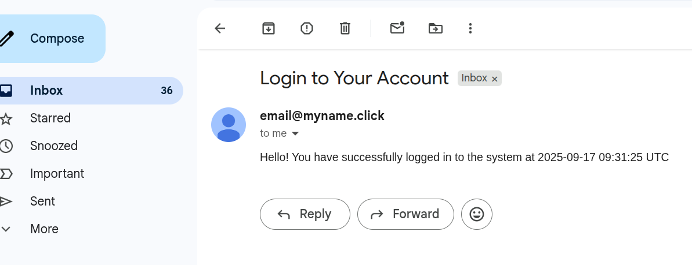

# Email Worker Service

.NET 8 background service for processing email messages from SQS and sending via SES.




## Features

- Continuous SQS message processing
- AWS SES email delivery integration
- Prometheus metrics and health monitoring
- Retry logic for failed deliveries
- Graceful shutdown and error handling

## Quick Start

```bash
cd application/email-worker
dotnet restore
dotnet run --project src/EmailWorker
```

## Configuration

```json
{
  "AWS": {
    "Region": "us-east-1",
    "SQS": {
      "QueueUrl": "https://sqs.us-east-1.amazonaws.com/account/queue-name"
    },
    "SES": {
      "FromEmail": "noreply@yourdomain.com",
      "FromName": "Email Service"
    }
  }
}
```

## Testing

```bash
dotnet test
dotnet test --collect:"XPlat Code Coverage"
```

## System Integration

1. **Message Consumption**: Continuously polls AWS SQS for email messages
2. **Email Processing**: Validates and processes email content
3. **Email Delivery**: Sends emails via AWS SES with retry logic
4. **Metrics Export**: Exposes Prometheus metrics on port 8080

---

**Developed by Sara**