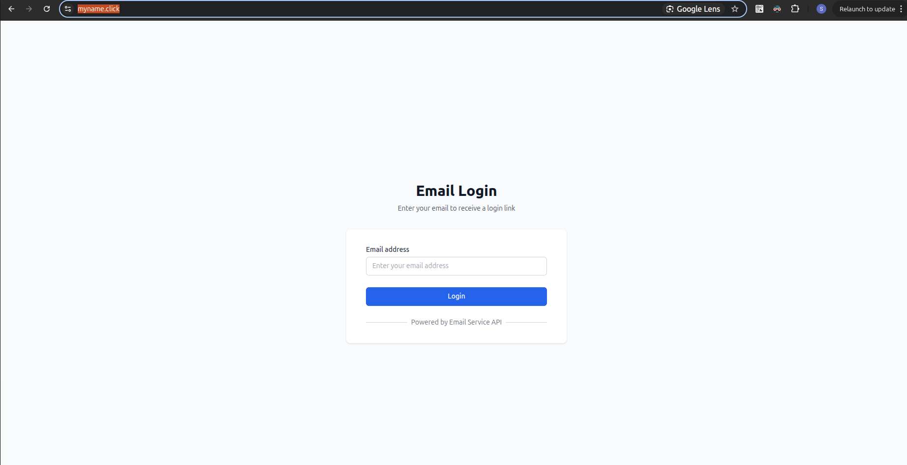

# Email Service Frontend

React application for email authentication interface.




## Features

- Modern React UI with Tailwind CSS
- Email validation and submission
- Responsive design with mobile support
- Real-time error handling and feedback
- Loading states and user experience optimization
- Jenkins CI/CD pipeline with S3 deployment
- Docker containerization for consistent deployment

## Quick Start

```bash
cd application/frontend
npm install
npm start
```

## Technology Stack

- React 18 with hooks
- Tailwind CSS for styling
- Create React App build system
- Fetch API for backend communication

## Configuration

```env
REACT_APP_API_URL=http://localhost:8080
```

## Testing

```bash
npm test
npm test -- --coverage
```

## System Integration

1. **User Interface**: Serves email submission form at MYNAME.CLICK
2. **API Communication**: Calls Backend API `/api/auth/login` endpoint
3. **Response Handling**: Displays success/error messages to users
4. **Static Delivery**: Deployed via AWS S3 and CloudFront CDN

---

**Developed by Sara**