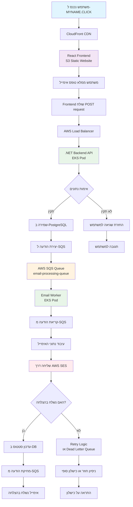
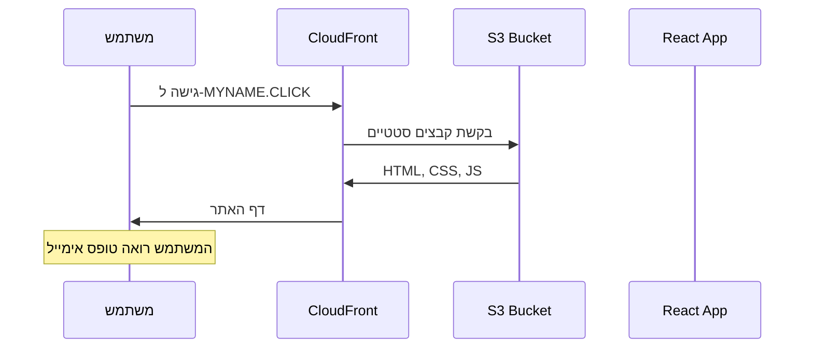
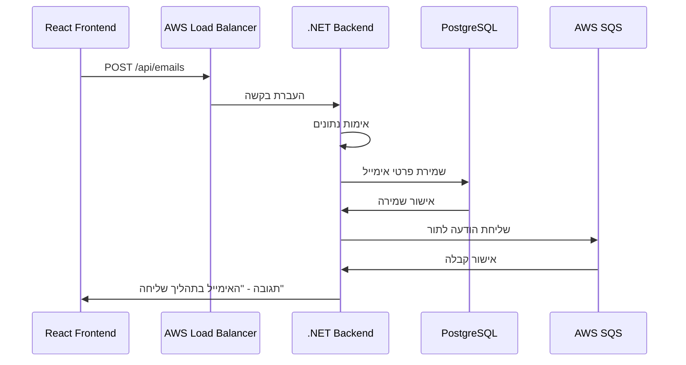
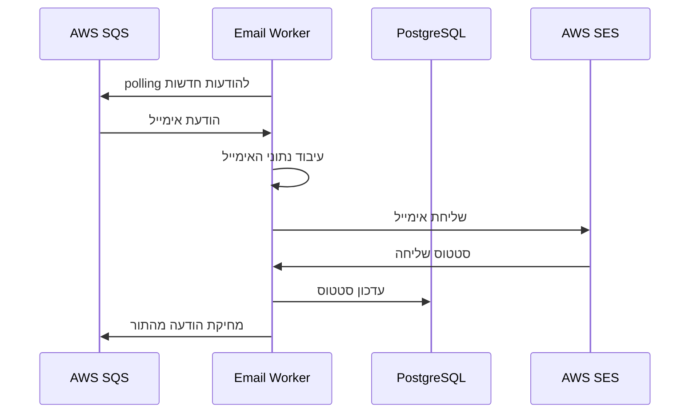

# זרימת המערכת - Automarkly Email Service

## דיאגרמת זרימה מלאה

## זרימה מפורטת צעד אחר צעד

### 1. כניסת המשתמש

### 2. שליחת אימייל

### 3. עיבוד האימייל

## רכיבי המערכת

### Frontend (React)
- **מיקום**: S3 + CloudFront
- **תפקיד**: ממשק משתמש לשליחת אימיילים
- **טכנולוגיה**: React, TypeScript

### Backend API (.NET)
- **מיקום**: EKS Pods
- **תפקיד**: קבלת בקשות, אימות, שמירה ב-DB, שליחה ל-SQS
- **טכנולוגיה**: .NET 8, ASP.NET Core

### Email Worker
- **מיקום**: EKS Pods
- **תפקיד**: עיבוד אימיילים מ-SQS ושליחה דרך SES
- **טכנולוגיה**: .NET 8, Background Service

### תשתית AWS
- **SQS**: תור הודעות אסינכרוני
- **SES**: שירות שליחת אימיילים
- **PostgreSQL**: מסד נתונים לאחסון
- **EKS**: Kubernetes cluster

## יתרונות הארכיטקטורה

1. **אמינות**: SQS מבטיח שהודעות לא יאבדו
2. **מדרגיות**: Workers יכולים להתרחב אוטומטית
3. **ביצועים**: עיבוד אסינכרוני
4. **ניטור**: Prometheus + Grafana
5. **אבטחה**: IRSA, Network Policies, TLS

## נקודות כישלון אפשריות

- **Retry Logic**: ניסיונות חוזרים על כישלונות זמניים
- **Dead Letter Queue**: הודעות שנכשלו מספר פעמים
- **Health Checks**: בדיקות תקינות רכיבים
- **Circuit Breaker**: הגנה מפני עומסים