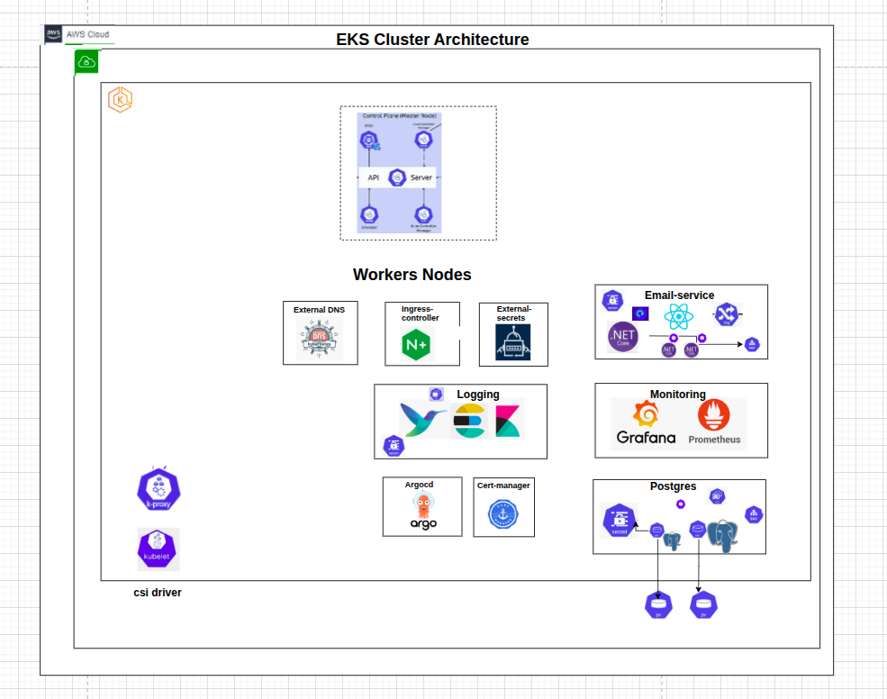
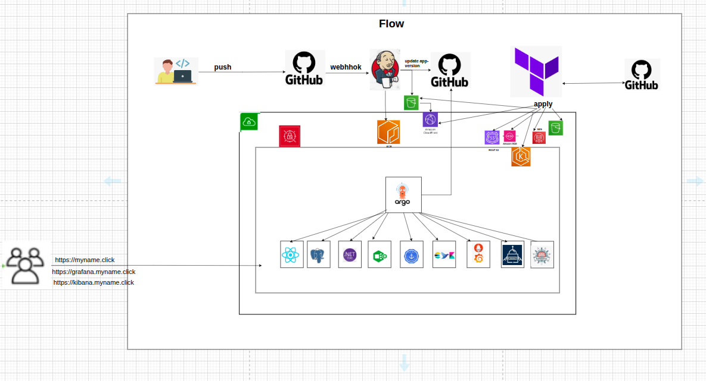

# GitOps Configuration

ArgoCD applications and Helm charts for Kubernetes deployment with comprehensive infrastructure management.






## Features

- **App of Apps Pattern**: Hierarchical application management
- **External Secrets**: AWS Secrets Manager integration
- **External DNS**: Automatic DNS record management
- **Cert Manager**: Automated TLS certificate provisioning
- **Monitoring Stack**: Prometheus, Grafana, AlertManager
- **Logging**: Elasticsearch, Fluent Bit centralized logging

## Quick Start

```bash
cd gitops
kubectl apply -f argocd/infra-app-of-apps.yaml
kubectl apply -f argocd/app-app-of-apps.yaml
```

## Namespace Architecture

```yaml
# Primary namespaces
email-service:     # Application workloads
  - backend (auth-service)
  - worker (email-service)  
  - postgresql database

argocd:           # GitOps management
cert-manager:     # TLS certificate automation
external-dns:     # DNS record management
external-secrets: # Secret synchronization
monitoring:       # Prometheus stack
logging:          # Elasticsearch stack
```

## Infrastructure Components

### External Secrets Integration
```yaml
# AWS Secrets Manager → Kubernetes Secrets
apiVersion: external-secrets.io/v1beta1
kind: ExternalSecret
metadata:
  name: postgresql-secret
  namespace: email-service
spec:
  secretStoreRef:
    name: cluster-secret-store
    kind: ClusterSecretStore
  target:
    name: postgresql-secret
  data:
  - secretKey: postgres-password
    remoteRef:
      key: email-service/postgresql
      property: password
```

### External DNS Configuration
```yaml
# Automatic DNS management for api.myname.click
annotations:
  external-dns.alpha.kubernetes.io/hostname: "api.myname.click"
```

### Service Accounts with IRSA
```yaml
# IAM Roles for Service Accounts
serviceAccount:
  backend:
    name: "auth-service"
    roleArn: "arn:aws:iam::980921758549:role/email-service-auth-service-role"
  worker:
    name: "email-service"
    roleArn: "arn:aws:iam::980921758549:role/email-service-email-service-role"
```

## Application Structure

### Backend Service
- **Namespace**: `email-service`
- **Service Account**: `auth-service` with SQS/RDS permissions
- **Ingress**: `api.myname.click` with TLS termination
- **Secrets**: PostgreSQL credentials via External Secrets

### Email Worker
- **Namespace**: `email-service`
- **Service Account**: `email-service` with SES/SQS permissions
- **Monitoring**: Prometheus ServiceMonitor
- **Secrets**: AWS credentials via IRSA

### PostgreSQL Database
- **Namespace**: `email-service`
- **Helm Chart**: Bitnami PostgreSQL 15.5.32
- **Secrets**: External Secrets managed credentials
- **Persistence**: EBS volume storage

## Monitoring & Observability

### Prometheus Stack
- **Namespace**: `monitoring`
- **Components**: Prometheus, Grafana, AlertManager
- **ServiceMonitors**: Automatic service discovery
- **Grafana Secrets**: External Secrets integration

### Logging Stack
- **Namespace**: `logging`
- **Components**: Elasticsearch, Fluent Bit
- **Log Aggregation**: All namespace logs centralized
- **Secrets**: Elasticsearch credentials via External Secrets

## TLS Certificate Management

### Cert Manager
```yaml
# Automatic TLS for api.myname.click
apiVersion: cert-manager.io/v1
kind: ClusterIssuer
metadata:
  name: letsencrypt-prod
spec:
  acme:
    server: https://acme-v02.api.letsencrypt.org/directory
    email: sara.beck.dev@gmail.com
    privateKeySecretRef:
      name: letsencrypt-prod
    solvers:
    - http01:
        ingress:
          class: nginx
```

## Deployment Pipeline

1. **Infrastructure Apps**: External DNS, Cert Manager, External Secrets
2. **Monitoring Stack**: Prometheus, Grafana, Elasticsearch
3. **Application Services**: Backend, Worker, PostgreSQL
4. **Ingress Configuration**: TLS termination and routing

## Configuration Management

### Values Structure
```yaml
global:
  domain: "myname.click"
  namespace: "email-service"
  environment: "production"
  email: "sara.beck.dev@gmail.com"

ingress:
  hosts:
    - host: api.myname.click
  tls:
    - secretName: email-service-tls
      hosts:
        - api.myname.click
```

---

**Developed by Sara**