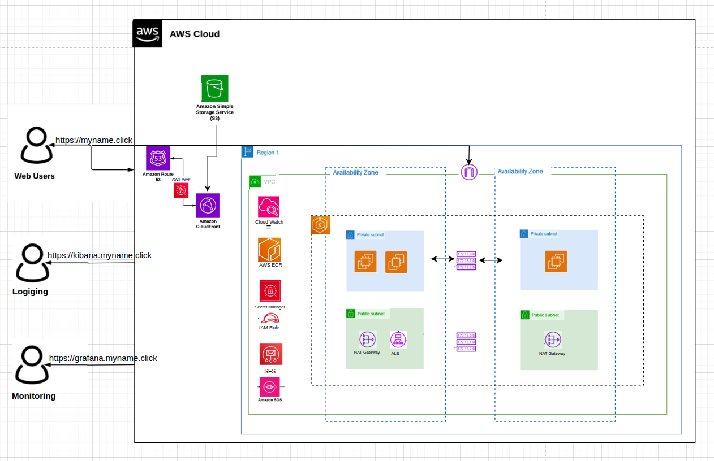

# Infrastructure as Code

Terraform configuration for AWS cloud infrastructure deployment.




## Features

- AWS EKS cluster with managed node groups
- VPC with public/private subnets
- RDS PostgreSQL database
- AWS SQS message queuing
- AWS SES email service configuration
- IAM roles and security policies

## Quick Start

```bash
cd infra
terraform init
terraform plan
terraform apply
```

## Infrastructure Components

### AWS Resources
- **EKS Cluster**: Kubernetes orchestration with managed node groups
- **VPC**: Multi-AZ network with public/private subnets
- **SQS**: Message queuing for email processing
- **SES**: Email delivery service with domain verification
- **S3 + CloudFront**: Static website hosting with CDN
- **Route53**: DNS management and domain routing
- **IAM**: IRSA roles for service accounts

### Kubernetes Components
- **ArgoCD**: GitOps deployment automation
- **Cert-Manager**: Automated TLS certificate provisioning
- **External DNS**: Automatic DNS record management
- **External Secrets**: AWS Secrets Manager integration

## Configuration

```bash
# terraform.tfvars
cluster_name = "email-service-cluster"
vpc_cidr = "10.0.0.0/16"
domain_name = "yourdomain.com"
admin_user_arn = "arn:aws:iam::account:user/admin"
```

## Modules

- `modules/vpc/` - VPC and networking
- `modules/eks/` - EKS cluster configuration
- `modules/rds/` - PostgreSQL database
- `modules/sqs/` - Message queuing
- `modules/ses/` - Email service

---

**Developed by Sara**